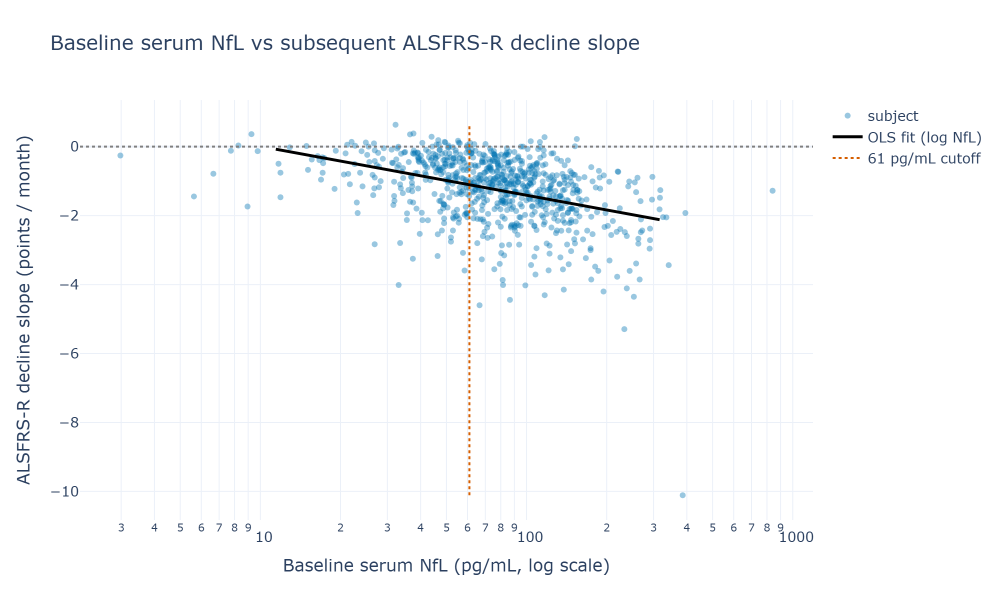
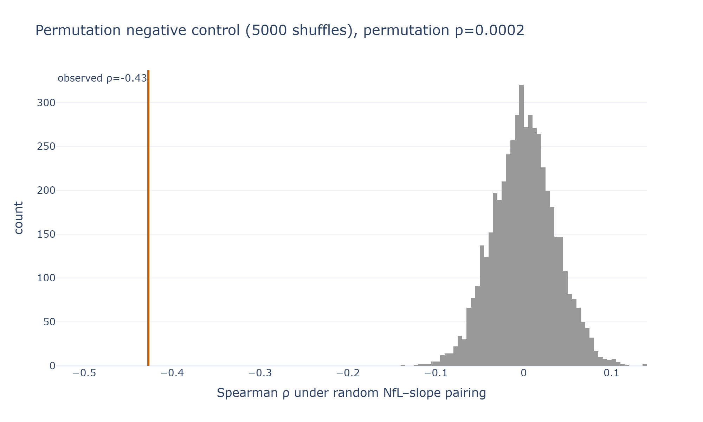
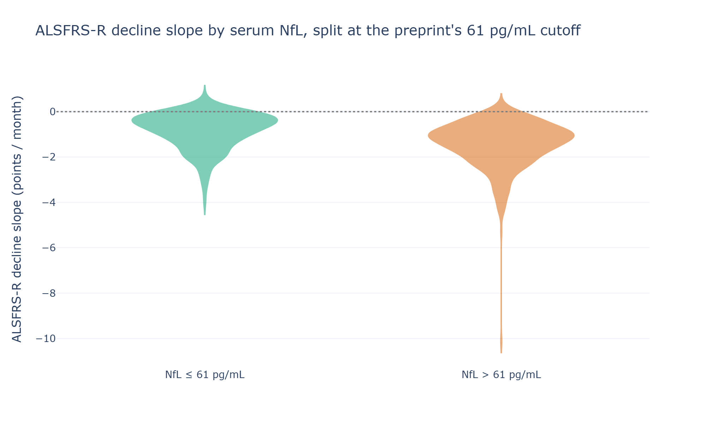
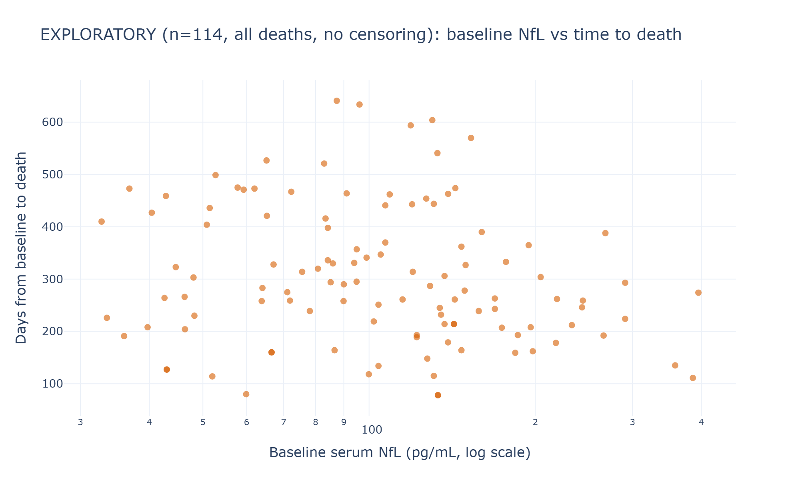

# Baseline blood neurofilament light chain (**NfL**) as a correlate of **ALSFRS-R** decline rate in PRO-ACT

**Experiment:** `projects/manu/nfl-alsfrs-slope` · **Hypothesis-log ID:** H-002 · **Owner:** Manu
**Date:** 2026-09-07 · **Dataset:** PRO-ACT (`data/PROACT_ALL_FORMS`, local snapshot)
**Status:** closed by adversarial review (4 independent lenses); see *Withdrawn / demoted claims*.

---

## Executive summary

In PRO-ACT, higher **baseline serum NfL** is associated with a **faster subsequent decline in
ALSFRS-R**. This is the one claim that survived adversarial review on all four lenses:
**Spearman ρ = −0.43** (95% CI [−0.48, −0.37], **n = 788**, permutation *p* = 2×10⁻⁴). It holds
after adjustment for age, sex, onset site, disease duration and baseline function, holds under
a precision-weighted re-estimation, and — per the survivorship lens — is if anything a
**conservative underestimate** (the selection filters remove high-NfL fast progressors, biasing
ρ toward zero). It **replicates the direction** of the motivating medRxiv preprint (plasma
*r* = −0.53), attenuated as expected for **serum** on a different assay.

Three secondary claims were **demoted** by the review and are reported here only with their
limits, not as evidence: the *magnitude* of the regression slope (specification-dependent), the
61 pg/mL cutoff contrast (a re-expression of the same effect, not independent corroboration),
and the survival signal (a collider-biased, decedent-only sample — **not testable here**).

> **Two caveats that frame everything below.**
> 1. **Observational (team rule 2):** these are correlations. NfL indexes the intensity of
>    axonal degeneration — the same process ALSFRS-R decline measures — so this is common-cause
>    territory, not proof of an NfL→progression mechanism.
> 2. **Non-representative cohort:** the 788 are a limb-onset-enriched (almost no bulbar),
>    faster-progressing, shorter-duration subgroup — the specific legacy trials that assayed
>    serum NfL, not PRO-ACT or ALS at large. The finding is demonstrated *in that frame*.

---

## Data

| Item | Detail |
|---|---|
| Source | PRO-ACT (Pooled Resource Open-Access ALS Clinical Trials), de-identified, local snapshot |
| Forms used | `F_PROACT_Neurofilament`, `F_PROACT_ALSFRS`, `F_PROACT_DEATHDATA`, `F_PROACT_ALSHISTORY`, `F_PROACT_DEMOGRAPHICS` |
| Join key | `subject_id` |
| **NfL** | Analyte = "Neurofilament light chain", 3,670 measurements in 814 subjects. **Serum only** used (3,580 serum vs 90 CSF rows). Unit pg/mL throughout. Baseline = earliest serum draw within 0–90 days (median draw day 27). Median baseline NfL **78.5 pg/mL** (IQR 52.6–115.1, **max 840 pg/mL** in the analyzed serum-baseline variable). |
| **ALSFRS-R slope** | Per-subject OLS slope of `ALSFRS_R_Total` on months over the first 18 months, requiring ≥3 visits spanning ≥90 days. 5,394 subjects have a fittable slope (**identical definition to H-001**). Each subject's slope carries its own standard error, used for the precision-weighted check below. |
| **Survival** | `Subject_Died` (Yes/No), `Death_Days` (days from baseline). |
| **Primary analysis cohort** | Subjects with **both** a baseline serum NfL and a fittable ALSFRS-R slope: **n = 788**. |
| Preprocessing | Numeric coercion; drop missing/non-positive NfL; log-transform NfL (right-skewed, max 840 pg/mL); restrict ALSFRS-R to 0–18 months. |

**Cohort composition (why generalizability is limited).** The 788 progress faster than the
other 4,606 slope-eligible subjects (mean slope −1.24 vs −1.04 pts/mo), enrol earlier (disease
duration 18 vs 20 months), and are **almost entirely limb-onset** (essentially no bulbar cases;
>50% carry no onset label). This is the fingerprint of one or a few NfL-substudy trials — PRO-ACT
strips trial IDs, so it cannot be adjusted away. Absolute NfL values and the 61 pg/mL threshold
are therefore likely **assay/trial-specific**.

**Missingness.** NfL exists for only ~8% of PRO-ACT. The onset-complete subset used by the
adjusted model is 365 of 788; dropping the onset requirement recovers 734 (see Finding 1).

---

## Hypothesis

For subject $i$ with baseline serum NfL $x_i$ (pg/mL) and fitted ALSFRS-R decline slope $s_i$
(points/month):

- **H1 (primary):** $\rho_{\text{Spearman}}(x_i, s_i) < 0$; in log-linear form
  $s_i = \beta_0 + \beta_1 \log x_i + \varepsilon_i$ with $\beta_1 < 0$, remaining $< 0$ after
  adjustment for confounders $\mathbf{z}_i$ (age, sex, onset, disease duration, baseline ALSFRS-R).
- **H1b (robustness, not confirmation):** the association is visible when NfL is split at
  61 pg/mL — tested as an *illustration on serum*, where absolute values differ from plasma.
- **H2 (secondary, exploratory):** higher baseline NfL is associated with shorter survival.

**Motivation (outside claim, recorded per research-watch).** medRxiv **preprint — not peer
reviewed** — Arguedas et al., *"Predictive ALS survival using ALSFRS-R slope & NfL"* (ALS/MND
Natural History Consortium, n = 300), reporting plasma NfL vs ALSFRS-R rate of change
*r* = −0.53 (95% CI −0.62 to −0.42) with a 61 pg/mL cutoff. Treated as a hypothesis to test, not
an established finding.

---

## Finding 1 — Higher baseline serum NfL tracks faster ALSFRS-R decline (SURVIVES)

**The result.** Across **n = 788**, baseline serum **NfL** correlates negatively with the
ALSFRS-R decline slope: **Spearman ρ = −0.43** (95% CI [−0.48, −0.37], bootstrap; *p* ≈ 3×10⁻³⁶,
reported for completeness — the effect size, not the p-value, is the claim). On log-NfL the
Pearson *r* = −0.41 (95% CI [−0.46, −0.35]).

**Robustness (what the four reviewers checked).** The association is stable across every
re-estimation, while the *magnitude* of the regression coefficient is not:

| Estimate | β₁ (ALSFRS-R pts/mo per log-unit NfL) | 95% CI | n |
|---|---|---|---|
| Unadjusted (full cohort) | −0.62 | [−0.71, −0.52] | 788 |
| Unadjusted, same cohort as adjusted | −0.56 | — | 365 |
| Adjusted (age, sex, onset, duration, baseline ALSFRS-R) | −0.47 | [−0.62, −0.32] | 365 |
| Adjusted, onset requirement dropped (less selected) | −0.51 | [−0.62, −0.40] | 734 |
| **Precision-weighted (WLS by slope SE)** | **−0.46** | [−0.51, −0.40] | 785 |
| Partial correlation controlling disease duration | *r* = −0.35 | — | 788 |

The rank correlation (ρ = −0.43) is the robust headline. The regression **β₁ magnitude is
specification-dependent** — it moves from −0.62 to −0.46 once each per-subject slope is weighted
by how precisely it was itself estimated (a generated-regressor correction), and part of the
"−0.62 → −0.47" adjustment story is a cohort shift, not adjustment (apples-to-apples on the same
365 subjects is −0.56 → −0.47). Disease duration is a genuine confounder, but controlling it
leaves a clear partial correlation (−0.35), so NfL is **not merely a proxy** for how early the
patient enrolled.

**Medical-level explanation.** **NfL** is a structural protein of the axonal cytoskeleton;
degenerating motor-neuron axons release it into CSF and blood, so circulating NfL indexes the
**rate of ongoing axonal destruction**. **ALSFRS-R** (0–48) tracks functional loss; its slope is
the standard progression-speed measure. Higher baseline NfL marking steeper subsequent ALSFRS-R
decline is mechanistically coherent — but because NfL and functional decline are two readouts of
the *same* degenerative process, this is a shared-cause association, not evidence that NfL drives
progression.

**Data-science-level explanation.** NfL is strongly right-skewed (median 78.5, max 840 pg/mL),
so the rank-based **Spearman ρ** is the headline (invariant to the skew) and **log-NfL** is used
parametrically. ρ ≈ −0.43 is a *moderate* effect (~18% of rank variance shared); we foreground it
over the vanishing p because large-n data make trivial effects extreme (team rule 1). Uncertainty:
2,000-sample bootstrap CI for ρ, Fisher-z CI for Pearson *r* (both verified correct by the
statistics lens — the bootstrap resamples pairs, not marginals). The outcome is itself an
estimate (per-subject OLS slope); the WLS row above is the honest treatment of that. Per-subject
slopes are pre-aggregated, so each subject contributes once (no repeated-measures leakage).

**Layperson explanation.** **NfL** is like debris shed from fraying electrical wiring: more of it
in the blood at the start goes with the wiring coming apart faster. Patients who started with
more debris tended to lose function (speech, walking, breathing, hand use) faster over the next
year and a half. It is a tendency across a crowd, not a verdict for any individual — the cloud of
points is real but scattered.

**Concrete example from the data.** Subject **`7527493`** had a high baseline serum NfL of
**211 pg/mL** and declined at **−2.15 ALSFRS-R points/month** (baseline 36). Subject
**`2963489`** had a low NfL of **25.5 pg/mL** and was **stable (≈ 0 points/month)** (baseline 45).
They mark the two ends of the gradient the cohort traces.

---

## Finding 2 — The association is not an artifact of chance pairing (SURVIVES)

**The result.** Shuffling the NfL–slope pairing 5,000 times gives a null Spearman ρ centred on 0
(mean 0.0005, SD 0.035). The observed **ρ = −0.43 lies entirely outside the null** — not one of
5,000 shuffles reached it — permutation *p* = 2×10⁻⁴.

**Medical-level explanation.** This adds no biology; it protects the claim, confirming the link
reflects each patient's own NfL matched to their own decline, not a coincidence of two
distributions.

**Data-science-level explanation.** Permutation breaks the NfL–slope dependency while preserving
both marginals, yielding the exact null for "no association." The observed statistic sits ~12
null-SDs out — the required **negative control on the headline effect** (team rule 3). A pipeline
that manufactured the correlation from a coding artifact would still signal under shuffling; this
does not.

**Layperson explanation.** We randomly re-matched each patient's marker to a different patient's
decline 5,000 times; random matching essentially never produced a link this strong, so the real
link is very unlikely to be a fluke.

**Concrete example from the data.** A representative shuffle of the same 788 values yields
ρ ≈ +0.01 (indistinguishable from zero); the true pairing yields ρ = −0.43.

---

## Finding 3 — The 61 pg/mL split (DEMOTED: a re-expression, not independent evidence)

**The result, and what it is.** Splitting at the preprint's **61 pg/mL**, subjects above it
(n = 520) decline at a mean **−1.44 points/month** vs **−0.84** for those at or below (n = 268).
**This is the same continuous association of Finding 1, re-expressed as a binary split — not a
second, independent confirmation.** The statistics lens flagged that presenting the group means,
a Welch test, and a log-NfL×group interaction as three results overstates the evidence: the
interaction term in particular is a collinearity artifact (the high/low indicator is a
deterministic step of log-NfL), so it must **not** be read as effect modification.

**Medical-level explanation.** A dichotomous threshold is clinically attractive for prognosis and
trial enrichment, and a serum threshold of this order does separate faster from slower
progressors here. But the 61 pg/mL value was derived in **plasma**; PRO-ACT NfL is **serum**, and
serum/plasma NfL on different assays are not interchangeable (a peer-reviewed 2026 *Muscle &
Nerve* report finds one platform reading ~6× lower than another). Read this as "high vs low,"
never as validation of 61 pg/mL specifically.

**Data-science-level explanation.** Dichotomizing a continuous predictor discards information and
inflates apparent group contrast; it is kept only as an interpretable picture of Finding 1. The
cutoff is *imported*, not fitted here, so it is not circular — but it is not extra evidence
either.

**Layperson explanation.** If we draw a line at the marker level the preprint used, people above
it lost function faster than people below. It is the same finding shown as two groups — and the
exact line depends on the lab test.

**Concrete example from the data.** Subject `7527493` (211 pg/mL, above the line) declined at
−2.15 pts/mo; subject `2963489` (25.5 pg/mL, below) was stable — the same two subjects, viewed
as high/low.

---

## Finding 4 — NfL and survival (DEMOTED: not testable in PRO-ACT)

**The result, and why it is not a finding.** Only **114** subjects have both a baseline serum
NfL and a death record, and **all 114 died** — there are **no censored (still-alive) subjects**.
The linkage is structurally decedent-only: within the NfL cohort, the death form records a day
*only* for deaths, and the 697 NfL subjects who did not have a linked death record simply never
enter. Any model fitted here **selects on the outcome** (a collider): it can only ask "among people
who died, does higher NfL rank with dying sooner," which is the within-decedent rank association
(Spearman ρ = −0.19, *p* = 0.04). A Cox restatement gives **HR = 1.24 per SD of log-NfL** (95% CI
[1.00, 1.54]) — but the CI touches 1.00 and *p* = 0.053, so it is null even on its own terms, and
it is **not a mortality hazard ratio**. Both the survivorship and statistics lenses judged even
the *direction* untrustworthy.

**Medical-level explanation.** Higher NfL plausibly predicts shorter survival (faster axonal loss
→ earlier respiratory failure), and the sign here is consistent — but a survival analysis with the
survivors structurally absent cannot estimate that without bias.

**Data-science-level explanation.** Cox regression needs censored observations to estimate the
hazard for survivors; with 0/114 censored the risk set never contains a survivor, so the estimate
is conditioned on having died. Reporting it (rather than deleting it) documents that H2 was
examined and found **not adequately testable in PRO-ACT** — a logged dead end.

**Layperson explanation.** We wanted to ask whether the marker predicts how long people live, but
for almost everyone with the marker we only have records of those who had already died — no fair
comparison group of survivors. The hint points the expected way, but we cannot trust the number
or even its direction.

**Concrete example from the data.** Subject `4506836` had a high baseline NfL of 218 pg/mL and
died 178 days after baseline — one point consistent with the trend, but 114 such points, all
deaths, cannot anchor a survival model.

---

## Withdrawn / demoted claims (recorded so no one re-derives them)

| Claim as first stated | Status | Mechanism that defeated it |
|---|---|---|
| "Adjusted for … **riluzole**" | **Withdrawn** | In this cohort the riluzole form has no "No" rows — the coded variable is a trial-presence flag, not a treatment contrast. No genuine riluzole user-vs-nonuser comparison exists; the covariate was removed from the model. |
| 61 pg/mL cutoff (Welch test + interaction) as **independent corroboration** | **Demoted** | It is the same continuous effect re-expressed by binning; the interaction coefficient is a collinearity artifact of splitting a variable already entered continuously. Kept only as an illustration. |
| "**Cox HR = 1.24** predicts survival" | **Demoted** | Decedent-only linkage (114/114 died, 0 censored) → selection on the outcome. Null on its own terms (CI [1.00, 1.54], p = 0.053); not a mortality HR. |
| Data section "max **27,212 pg/mL**" | **Corrected → 840** | That value was an excluded **CSF** outlier carried over from the unfiltered recon; the analyzed serum-baseline variable maxes at 840 pg/mL. |
| β₁ ≈ **−0.62 pts/mo per log-unit** as a firm magnitude | **Qualified** | Generated-regressor structure: precision-weighting moves it to −0.46; the magnitude is specification-dependent (the correlation is not). |

**What held, and on what:** the primary rank association (ρ = −0.43, n = 788) survived all four
lenses — confounding (survives adjustment and a partial correlation controlling duration),
survivorship (biased *toward* the null, so conservative), statistics (correct estimators, no
circularity), and reproducibility (byte-identical re-runs, all numbers tie to the pipeline).

---

## Comparison to the motivating preprint

| | Preprint (Arguedas et al., medRxiv, **not peer reviewed**) | This analysis (PRO-ACT) |
|---|---|---|
| Matrix | Plasma | **Serum** |
| n (correlation) | 300 | **788** |
| NfL vs ALSFRS-R rate | *r* = −0.53 [−0.62, −0.42] | ρ = −0.43 [−0.48, −0.37] |
| 61 pg/mL cutoff | association differs at cutoff | present on serum, but assay-dependent; not independent evidence |
| Survival | reported predictive | **not adequately testable here** (no censoring) |

**Direction replicates; magnitude attenuates** — consistent with serum-vs-plasma matrix, assay
differences, and a limb-enriched cohort. A genuinely new test of the claim on an independent,
larger cohort, not a duplication.

---

## Limitations & caveats

1. **Observational** — correlation, not causation; NfL and ALSFRS-R decline share a cause.
2. **Non-representative cohort** — limb-enriched, near-bulbar-free, faster-progressing,
   short-duration; a single/few-substudy frame, not PRO-ACT or ALS at large.
3. **Serum ≠ plasma** — absolute NfL and the 61 pg/mL cutoff are assay/matrix-dependent.
4. **Coverage** — NfL exists for ~8% of PRO-ACT.
5. **β magnitude is specification-dependent** — generated-regressor structure (the outcome is an
   estimated slope); the rank correlation is robust, the coefficient magnitude less so.
6. **Survivorship in the slope** — requiring ≥3 visits over ≥90 days under-represents the fastest
   progressors, biasing the NfL–slope association **toward zero** (conservative for H1).
7. **Survival not testable** — decedent-only linkage, no censoring.

---

## Reproducibility

- **Script:** `projects/manu/nfl-alsfrs-slope/scripts/analysis.py` (end-to-end; also `recon.py`).
- **Standing gate:** `projects/manu/nfl-alsfrs-slope/claims.json` ties every headline number to
  the pipeline output (`python .claude/skills/adversarial-review/scripts/claim_audit.py claims.json --root .`).
- **Environment:** `.venv` (pandas, numpy, scipy, statsmodels, lifelines, plotly, kaleido).
- **Run:** `…/.venv/Scripts/python.exe …/scripts/analysis.py`
- **Outputs:** `results.json`, `fig1`–`fig4` (HTML + PNG), `subject_level.csv` (local only).
- **Determinism:** RNG seed 20260907 for the bootstrap CI and the 5,000-shuffle permutation;
  re-runs are byte-identical (verified, reproducibility lens).
